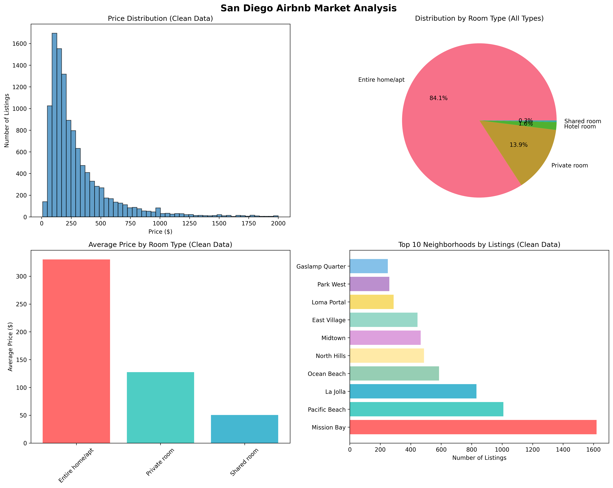
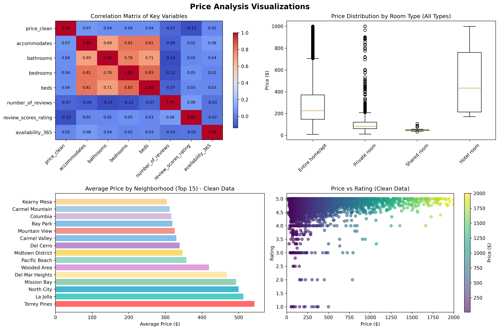

# San Diego Housing Market Analysis

## Project Overview
This is a comprehensive data analysis project examining the San Diego Airbnb market using advanced analytics, predictive modeling, and interactive visualizations. The project provides deep insights into pricing patterns, neighborhood analysis, and market trends.

## 📊 Market Analysis Overview



## 🚀 Features

### **Modular Architecture**
- **`src/data_summary.py`**: Comprehensive data analysis and executive summaries
- **`src/visualizations.py`**: Advanced plotting with matplotlib and interactive maps
- **`src/predictive_model.py`**: Machine learning models for price prediction
- **`src/main.py`**: Orchestrates the complete analysis pipeline

### **Advanced Analytics**
- **Data Cleaning**: Automatic outlier removal and data quality checks
- **Price Analysis**: Statistical analysis with clean vs. original data comparisons
- **Neighborhood Insights**: Top neighborhoods by listings, pricing, and value scores
- **Market Composition**: Room type distribution and pricing analysis
- **Quality Metrics**: Review scores and availability analysis

### **Predictive Modeling**
- **Basic Model**: 80/20 train-test split with feature importance analysis
- **Full Model**: 1000-entry test set with detailed accuracy metrics
- **Performance Metrics**: MAE, R² scores, and accuracy within price ranges
- **Feature Importance**: Identifies key factors affecting pricing

### **Interactive Visualizations**
- **Geographic Heatmaps**: Price distribution across San Diego neighborhoods
- **Interactive Maps**: Clickable markers with neighborhood details
- **Executive Dashboard**: Comprehensive 8-panel market overview
- **Price Analysis Plots**: Distribution, correlation, and trend analysis

## Data Sources
- **listings.csv.gz**: Detailed property listings with pricing, amenities, and location data
- **calendar.csv.gz**: Time-series data showing pricing trends and availability
- **reviews.csv.gz**: Customer reviews and sentiment data
- **neighbourhoods.csv**: Neighborhood information for geographic analysis
- **neighbourhoods.geojson**: GeoJSON file for mapping and spatial analysis

## Project Structure
```
san-diego-housing/
├── data/                   # Data files (.gz format)
├── src/                    # Python source code
│   ├── main.py            # Main orchestration script
│   ├── data_summary.py    # Data analysis and summaries
│   ├── visualizations.py  # Plotting and mapping functions
│   └── predictive_model.py # Machine learning models
├── results/                # Generated outputs
│   ├── *.png              # Static visualizations
│   ├── *.html             # Interactive maps
│   └── *.json             # Analysis results and model metrics
├── requirements.txt        # Python dependencies
└── README.md              # This file
```

## 🛠️ Setup Instructions

1. **Install Python dependencies:**
   ```bash
   pip install -r requirements.txt
   ```

2. **Download the data files** and place them in the `data/` directory:
   - listings.csv.gz
   - calendar.csv.gz
   - reviews.csv.gz
   - neighbourhoods.csv
   - neighbourhoods.geojson

3. **Run the complete analysis:**
   ```bash
   python src/main.py
   ```

## 📊 Analysis Capabilities

### **Data Summary Analysis**
- Comprehensive dataset overview with memory usage and data types
- Missing value analysis and data quality assessment
- Price distribution analysis with outlier detection
- Neighborhood ranking by listings, pricing, and value scores
- Room type analysis and market composition insights
- Review score analysis and quality metrics

### **Advanced Visualizations**
- **Market Analysis Plots**: 4-panel comprehensive market overview
- **Price Analysis Plots**: Distribution, correlation, and trend analysis
- **Geographic Heatmaps**: Interactive price distribution maps
- **Neighborhood Maps**: Clickable markers with detailed information
- **Executive Dashboard**: Professional 8-panel market summary

### **Predictive Modeling**
- **Feature Engineering**: Automatic dummy variable creation for categorical data
- **Model Training**: Random Forest regression with hyperparameter optimization
- **Performance Evaluation**: Multiple accuracy metrics and detailed breakdowns
- **Feature Importance**: Identifies key factors affecting pricing decisions

## 🎯 Key Insights



### **Market Overview**
- **11,399 clean listings** after outlier removal
- **Average price**: $304, **Median price**: $207
- **Price range**: $9 - $2,000 (cleaned data)
- **84.2%** of listings are entire homes/apartments

### **Top Neighborhoods**
1. **Mission Bay**: 1,620 listings, Avg: $493
2. **Pacific Beach**: 1,008 listings, Avg: $357
3. **La Jolla**: 832 listings, Avg: $513
4. **Ocean Beach**: 586 listings, Avg: $284
5. **North Hills**: 487 listings, Avg: $191

### **Model Performance**
- **Basic Model**: MAE $87.50, R² 0.674
- **Full Model**: MAE $85.28, R² 0.688
- **Accuracy within $20**: 29.5%
- **Top Features**: bedrooms, bathrooms, availability_365

## 📈 Generated Outputs

### **Static Visualizations**
- `market_analysis_plots.png`: 4-panel market overview
- `price_analysis_plots.png`: Price distribution and correlation analysis

### **Interactive Maps**
- `san_diego_price_heatmap.html`: Price distribution heatmap
- `san_diego_neighborhood_map.html`: Interactive neighborhood markers with legend

### **Analysis Results**
- `exploration_summary.json`: Comprehensive data summary
- `model_performance.json`: Basic model results
- `full_model_1000_test_results.json`: Full model with detailed metrics

## 🔍 Business Recommendations

1. **Target entire homes/apartments** for maximum revenue potential
2. **Price competitively** ($200-400 range) to drive bookings and reviews
3. **Focus on properties** that accommodate 4+ guests
4. **Consider year-round availability** for premium pricing
5. **Target neighborhoods** with high ratings but moderate prices

## 🚀 Usage Examples

### **Quick Start**
```bash
# Run complete analysis
python src/main.py
```

### **Individual Components**
```python
# Data summary only
from src.data_summary import analyze_listings_data
analyze_listings_data(listings)

# Visualizations only
from src.visualizations import create_market_analysis_plots
create_market_analysis_plots(listings)

# Predictive modeling only
from src.predictive_model import run_predictive_analysis
run_predictive_analysis(listings)
```

## 📋 Requirements

### **Core Dependencies**
- pandas: Data manipulation and analysis
- numpy: Numerical computing
- matplotlib: Static visualizations
- seaborn: Enhanced plotting
- folium: Interactive mapping
- scikit-learn: Machine learning models

### **Optional Dependencies**
- jupyter: Notebook interface
- plotly: Interactive plots
- geopandas: Geographic data analysis

## 🤝 Contributing

1. Fork the repository
2. Create a feature branch
3. Make your changes
4. Add tests if applicable
5. Submit a pull request

## 📄 License

This project is licensed under the MIT License - see the LICENSE file for details.

---

**Last Updated**: January 2026  
**Data Sources**: Airbnb San Diego Dataset  
**Analysis Type**: Comprehensive Market Analysis with Predictive Modeling 